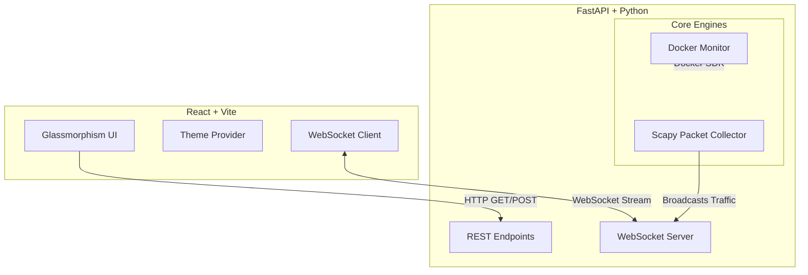

<div align="center">
  <h1>🌊 StatSea</h1>
  <strong>Premium Real-time Network Intelligence & Telemetry Dashboard</strong>

  <p align="center">
    <a href="#features">Features</a> •
    <a href="#tech-stack">Tech Stack</a> •
    <a href="#getting-started">Getting Started</a> •
    <a href="#architecture-overview">Architecture</a>
  </p>

  
  
  
  
</div>

---

**StatSea** is a state-of-the-art network monitoring dashboard precision-engineered for home-lab enthusiasts, sysadmins, and developers. Built with a stunning modern glassmorphism UI, it provides deep packet inspection, real-time bandwidth metrics, device discovery, and Docker container network tracking all in one place.

> **📸 Note to developer:** Take a screenshot of your beautiful dashboard and place it in the repository (e.g., `docs/screenshot.png`), then add `` here!

## ✨ Key Features

- **🚀 Real-time Telemetry:** Stream live network data via WebSockets with zero latency.
- **📊 Advanced Analytics:** Interactive charts for bandwidth, protocol distribution, and packet sizes.
- **📱 Device Tracking:** Automatic ARP/DHCP discovery to track all devices on your local network.
- **🌍 Connections Globe:** Visualize external IPs and connection destinations in real-time.
- **🐳 Docker Integration:** Monitor CPU, memory, and network usage of running Docker containers.
- **🛡️ Security & DNS Logs:** Track DNS queries and monitor anomalous network behavior.
- **🎨 Premium UI:** Fully theme-aware components, dark mode optimized, powered by Tailwind CSS and Lucide icons.

## 🛠️ Tech Stack

**Frontend:**
- [React](https://reactjs.org/) + [Vite](https://vitejs.dev/)
- [Tailwind CSS](https://tailwindcss.com/) (Fully theme-aware CSS variables)
- [Recharts](https://recharts.org/) (Data Visualization)
- [Lucide React](https://lucide.dev/) (Icons)

**Backend:**
- [Python](https://www.python.org/) 3.11+
- [FastAPI](https://fastapi.tiangolo.com/) (REST & WebSockets)
- [Scapy](https://scapy.net/) (Packet capture & deep packet inspection)
- [SQLAlchemy](https://www.sqlalchemy.org/) (Database ORM)

---

## 🚀 Getting Started

### Prerequisites

- **Node.js** (v18+)
- **Python** (v3.11+)
- **Npcap** (Windows) or `libpcap` (Linux/macOS) for packet capturing
- **Docker** (optional, for monitoring containers)

### 1. Backend Setup

The backend requires privileged access to capture network packets.

```bash
# Clone the repository
git clone https://github.com/yourusername/StatSea.git
cd StatSea/backend

# Create a virtual environment
python -m venv venv
source venv/bin/activate  # On Windows use: venv\Scripts\activate

# Install dependencies
pip install -r requirements.txt

# Run the backend server (FastAPI)
python -m uvicorn app.main:app --host 0.0.0.0 --port 8000 --reload
```
> **Note:** On Linux, you may need to run the backend with `sudo` to allow `scapy` to promiscuously monitor network interfaces.

### 2. Frontend Setup

```bash
# Open a new terminal and navigate to the frontend directory
cd StatSea/frontend

# Install dependencies
npm install

# Start the Vite development server
npm run dev
```

The frontend will be available at `http://localhost:5173`. 

---

## 🐳 Docker / CasaOS Deployment

StatSea is optimized for HomeLab and CasaOS deployment. 

```bash
# Run using the provided Docker Compose file
docker-compose up -d
```

To install directly in **CasaOS**:
1. Go to **App Store** > **Custom Install**.
2. Set the WebUI port, point to the Docker image, and deploy.
3. *Ensure the container is set to "Host" network mode to capture router/gateway traffic.*

---

## 🏗️ Architecture Overview



---

## 📖 API Documentation

Once the backend is running, you can interact with the auto-generated Swagger documentation:

- **Swagger UI:** `http://localhost:8000/docs`
- **ReDoc:** `http://localhost:8000/redoc`

---

## 🤝 Contributing

Contributions are welcome! Please feel free to submit a Pull Request.

1. Fork the project
2. Create your feature branch (`git checkout -b feature/AmazingFeature`)
3. Commit your changes (`git commit -m 'Add some AmazingFeature'`)
4. Push to the branch (`git push origin feature/AmazingFeature`)
5. Open a Pull Request

---

## 📄 License

This project is licensed under the MIT License - see the [LICENSE](LICENSE) file for details.

---

<div align="center">
  <i>Designed and developed with ❤️ for the HomeLab community.</i>
</div>
